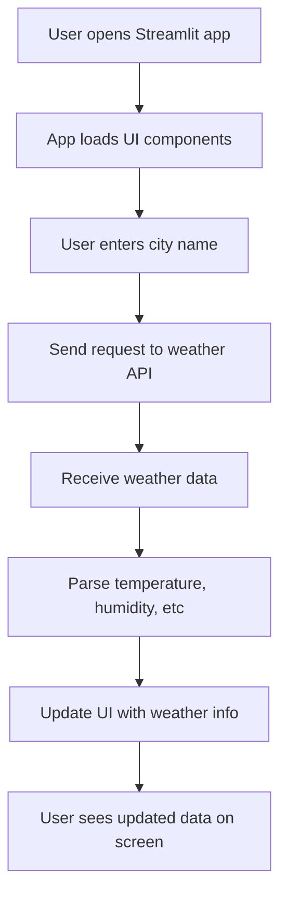

# Weather_App

live demo :https://weatherapp-bymarutimargale.streamlit.app/

## 🔁 Application Flow (Streamlit Version)

The following flowchart shows how the Streamlit weather application works behind the scenes:

